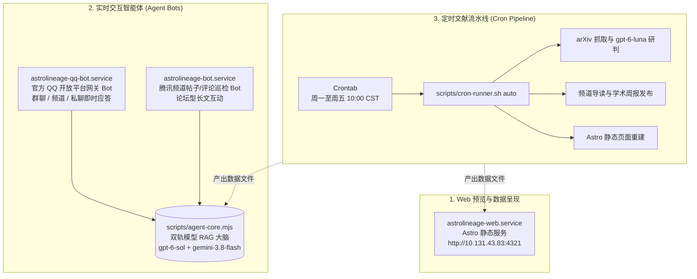

# AstroLineage 服务拓扑与系统运维手册 (Service Topology & Operations Runbook)

本文档汇总 AstroLineage 系统的常驻后台守护进程、定时流水线、自检诊断工具及常见故障排查指南。

---

## 一、系统服务拓扑 (Service Topology)

AstroLineage 运行于本地 Linux 环境（Systemd User 作用域），由以下 3 个常驻守护服务和 1 个自动化定时流水线共同组成：



### 1. 服务清单

| 服务名称 | 类别 | 运行文件 / 命令 | 核心功能与职责 |
| :--- | :--- | :--- | :--- |
| **`astrolineage-web.service`** | Systemd User | `astro dev / astro build` | 承载校园网内文献知识库预览 (`http://10.131.43.83:4321`) |
| **`astrolineage-qq-bot.service`** | Systemd User | `node scripts/qq-official-bot.mjs` | 连接腾讯官方 WebSocket Gateway，负责 QQ 群、公域/私域频道与私聊即时学术交互 |
| **`astrolineage-bot.service`** | Systemd User | `node scripts/tencent-channel-bot.mjs` | 定时轮询腾讯频道论坛版块的帖子与评论，执行长文研读与互动 |
| **arXiv 自动化定时任务** | Crontab | `scripts/cron-runner.sh auto` | 周一至周五 10:00 CST 执行抓取、AI 研判、构建页面与频道自动发布 |

---

## 二、一键健康检查与诊断 (`--doctor`)

默认诊断仅检查本地配置，不申请 token、不调用模型、不发送 QQ 消息：

```bash
node scripts/qq-official-bot.mjs --doctor
```

需要真实连通性检查时，显式运行 `node scripts/qq-official-bot.mjs --doctor --live`。该模式会申请 token 并调用收费模型，但不发送 QQ 消息。CI 不得使用 `--live`。

### 显式 live 诊断步骤说明
1. **环境变量**：核验 `QQ_APP_ID`（纯数字格式）与 `QQ_APP_SECRET`（纯 32 位 Hex，且无非法前缀）；
2. **官方 OAuth 凭据交换**：通过 `getAppAccessToken` 向腾讯开放平台换取动态 AccessToken；
3. **官方 Gateway 路由**：向 `api.sgroup.qq.com/gateway` 确认 WebSocket 网关地址可达；
4. **AI 模型连通性**：向 `gpt-6-sol`（或备用 `gemini-3.8-flash-high`）发起微量连通性测试探针；
5. **本地数据缓存完整性**：检查 `arxiv-daily.json`、`daily-radar.json`、`arxiv-weekly.json` 的有效性。

**退出码约定**：
- `0`：所选检查通过；默认离线模式不证明凭据、网关或模型可用；
- `1`：检测到异常项，并在控制台输出明确的定位修复指引。

### 安全与上线门槛

- 模型凭据只能来自环境变量。曾在源码中出现的备用密钥必须在供应商处轮换；移除源码不等于撤销旧密钥。
- 主、备用模型请求只允许 HTTPS，禁止重定向。备用服务必须显式配置 `FALLBACK_OPENAI_BASE_URL` 和密钥；HTTP 备用地址会被拒绝，不自动猜测 HTTPS 地址。
- Node >=22.20 的原生 WebSocket，无需单独安装 `ws`。请求有超时、模型输入/输出大小上限；同时最多处理 4 个回复，超量消息不排队。
- 消息去重仅覆盖当前进程内 30 分钟（最多 2000 ID），不承诺跨重启 exactly-once；失败或超量时可用新消息重试。
- 知识状态读取已发布 feed/radar 并复用导读校验，未导读不是排除；核心书目使用通过验证的可见 projection。未接入 NotebookLM，不声称读过全文。
- 代码测试通过后仍需受控重启及真实群/私聊验收；不要把旧进程在线当作新版本已上线。

---

## 三、常用运维管理指令

### 1. 查看与控制守护进程
```bash
# 查看所有 AstroLineage 服务运行状态
systemctl --user status astrolineage-web.service astrolineage-bot.service astrolineage-qq-bot.service

# 重启指定服务
systemctl --user restart astrolineage-qq-bot.service
systemctl --user restart astrolineage-bot.service
systemctl --user restart astrolineage-web.service

# 开机自启设置
systemctl --user enable astrolineage-qq-bot.service
```

### 2. 查看实时日志
```bash
# 查看官方 QQ 机器人实时日志（群消息、事件流、心跳、应答）
journalctl --user -u astrolineage-qq-bot.service -f

# 查看腾讯频道论坛 Bot 巡检日志
journalctl --user -u astrolineage-bot.service -f

# 查看每日定时流水线日志
tail -f /tmp/arxiv-task.log
```

---

## 四、常见故障排查手册 (Troubleshooting)

### 1. QQ 机器人无法收到群消息
- **排查沙箱群配置**：未正式过审发布的机器人仅在开发者沙箱配置群中生效。检查 [QQ 开放平台 (q.qq.com)](https://q.qq.com) 后台的“沙箱配置”中是否已添加当前群号与测试人员 QQ。
- **排查事件订阅**：后台需开通 `GROUP_AT_MESSAGE_CREATE` 权限。
- **排查群内设置**：手机 QQ 群设置 -> 群机器人 -> 确认开启“允许接收消息”。

### 2. 鉴权报错 (100016 / 11245)
- **100016: invalid appid or secret**：确认 `.env` 中填写的 `QQ_APP_SECRET` 是后台点击“查看”复制的 32 位开发者密钥，而不是第三方工具导出的带 `bot:v1_` 前缀的字符串。
- **11245: 固定Token已禁用**：腾讯现已废弃旧版长期 Token，必须使用 `QQ_APP_ID` + `QQ_APP_SECRET` 组合。

### 3. 测试环境 Inode 耗尽 (ENOSPC)
- 系统已在 `package.json` 的 `pretest` 和 `posttest` 中集成 `node scripts/cleanup-test-tmp.mjs`。
- 测试套件临时目录使用 `createTemporaryWorkspace` 自动由 `t.after()` 销毁，确保 `/tmp` 目录保持净零残留。
